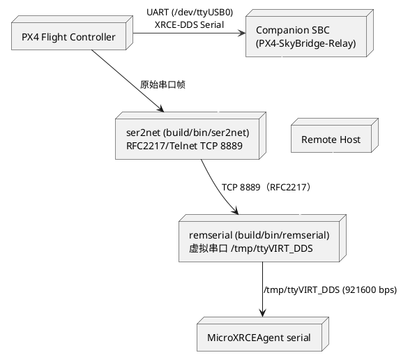
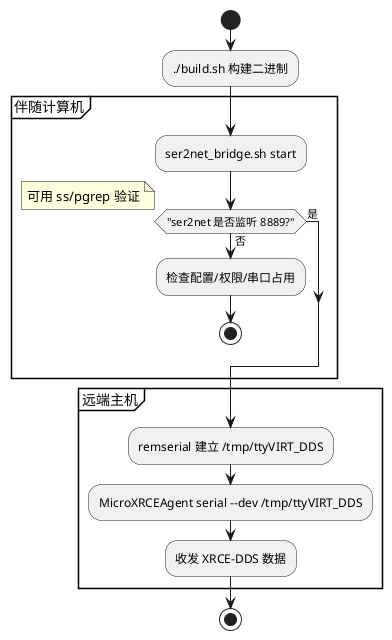

# 使用 ser2net + remserial 透传 PX4 的 XRCE-DDS 串口（仓库内构建版）

> 本文完全基于本仓库的子模块与 `./build.sh` 产物，不依赖 `apt install ser2net` 或 `apt install remserial`。所有可执行文件都位于 `build/bin/`。

## 总览



## 预备步骤

1. **下载并初始化子模块**
   ```bash
   git submodule update --init --recursive
   ```
2. **构建所有依赖**
   ```bash
   ./build.sh
   ls build/bin
   ```
   若构建成功，可看到 `mavlink-routerd`, `ser2net`, `remserial` 等文件。

## ser2net 配置（伴随端）

### 配置文件

`config/ser2net_skybridge.conf`（YAML v1）示例：

```yaml
%YAML 1.1
---
define: &banner_skybridge "PX4 SkyBridge ser2net (ttyUSB0 -> TCP 8889)"

connection: &px4_uart
  accepter: telnet(rfc2217),tcp,0.0.0.0,8889
  connector: serialdev,/dev/ttyUSB0,921600n81,local
  options:
    banner: *banner_skybridge
    kickolduser: true
    max-connections: 1
```

可按需复制该文件修改串口或端口，然后通过 `SER2NET_CONF=/path/...` 指定给脚本。

### 启动方式

#### 推荐：`scripts/ser2net_bridge.sh`

```bash
chmod +x scripts/ser2net_bridge.sh
scripts/ser2net_bridge.sh start   # 默认使用 build/bin/ser2net + config/ser2net_skybridge.conf
scripts/ser2net_bridge.sh status
scripts/ser2net_bridge.sh stop
```

可用环境变量覆盖：
- `SER2NET_BIN=/path/to/custom`（默认 `build/bin/ser2net`）
- `SER2NET_CONF=/path/to/custom.yaml`

#### 手动运行（调试）

```bash
build/bin/ser2net -c config/ser2net_skybridge.conf
```

默认 daemon 化；可加 `-n -d` 前台输出日志，便于调试。

### 确认运行状态

| 场景 | 命令 |
| --- | --- |
| 查看进程 | `pgrep -af ser2net` |
| 检查监听端口 | `ss -tnlp sport = :8889` |
| 使用脚本 | `scripts/ser2net_bridge.sh status` |

## 远端 remserial + MicroXRCEAgent

### 步骤

1. **建立虚拟串口**
   ```bash
   build/bin/remserial -d \
     -r <COMPANION_IP> \
     -p 8889 \
     -l /tmp/ttyVIRT_DDS \
     -s "921600 raw"
   ```
   - `-d` 后台运行；移除即可前台调试。
   - `-l` 指定恒定的 PTY 符号链接。
2. **启动 XRCE Agent**
   ```bash
   MicroXRCEAgent serial --dev /tmp/ttyVIRT_DDS -b 921600
   ```
3. **停止 remserial**
   - 前台运行：Ctrl + C。
   - 若后台运行，可用 `pkill remserial` 或在启动时记录其 PID。

### 流程概览



## 调优/排障

- **延迟或丢帧**：在配置中加入 `chardelay-min/chardelay-max`、适度降低波特率。
- **端口被占用**：`ss -tnlp sport = :8889` 查明占用方，或修改 `accepter` 端口。
- **远端无法重连**：`kickolduser: true` 已默认启用；若依旧卡住，确认 remserial 已退出。
- **虚拟串口未创建**：确保 `/tmp` 可写、用户在 `tty` 组，并且 `remserial` 具备读取 `/dev/pts` 的权限。

## 为什么选择 RFC2217 + 本地编译

1. **完全离线**：所有依赖由仓库子模块提供，`./build.sh` 在本地生成可执行文件，无需网络安装包。
2. **针对 XRCE-DDS 的稳定性**：ser2net/gensio 具备串口缓冲和 RFC2217 控制，避免简单 TCP 透传导致帧错位。
3. **一致的部署路径**：`build/bin/` 统一存放二进制，脚本直接引用，方便打包或 systemd 集成。

## 下一步（可选建议）

- 将 `scripts/ser2net_bridge.sh` 写入 systemd 单元，以便开机自动启动。
- 在远端编写 wrapper（例如 `systemd --user` 或 supervisord）守护 remserial + MicroXRCEAgent。
- 若需要加密/鉴权，可研究 gensio 的 `ssl`、`certauth` 选项，并在配置中叠加。
